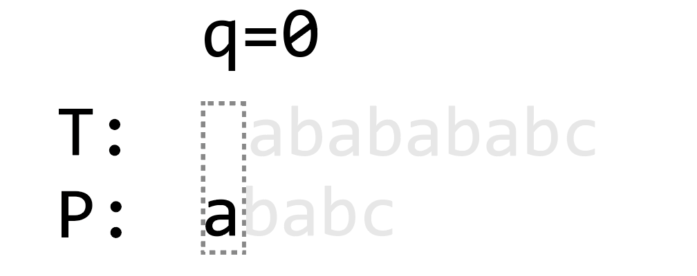
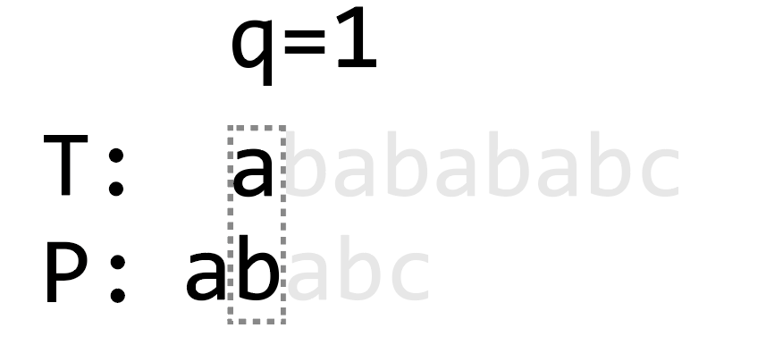
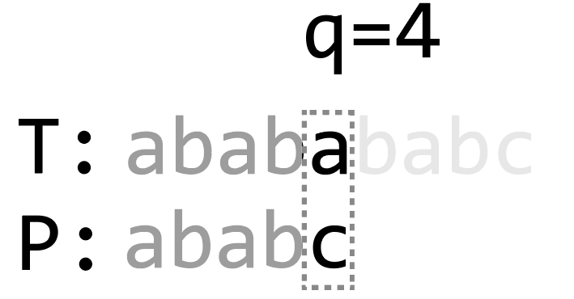

# 字符串匹配算法总结

> 本文为 CLRS 3rd ed. 第 32 章内容的总结概括，同时也总结概括了一些其他优秀的 String-matching 算法，完整参考资料详见文末“参考资料”部分。

字符串匹配算法（String-matching algorithm），a.k.a 字符串搜索算法（String-searching algorithm）是一类重要的字符串算法。它要解决的问题是如何在一个长字符串中，找到另一个短字符串出现的位置。

## 问题描述

给定一个长为 $n$ 的字符串 $T[1..n]$（the text）和一个长为 $m (m \le n)$ 的字符串 $P[1..m]$（the pattern），我们需要确定 1. $H$ 中是否含有 $E$，2. 若含有，$H$ 中的 $E$ 的位置在哪里。

> 有时 the text $T$ 会被称为 the "haystack"，the pattern $P$ 会被称为 the "neddle"

$T$ 和 $P$ 定义在一个有限字母集（alphabet）$\Sigma$ 上。

我们称 $P$ 以 $s$ 的位移（shift）出现在 $T$ 中 或 $P$ 出现在 $T$ 的第 $s+1$ 个位置意味着：
1. $0 \le s \le n - m$，且
2. $T[s+1..s+m] = P[1..m]$

若 $P$ 在 $T$ 中以位移 $s$ 出现，则称 $s$ 为有效位移，否则 $s$ 就为无效位移。

于是，问题就可以形式化的描述为：***给定 $T$，找出所有 $P$ 的有效位移***。

## Notation & Terminology

### 字符串及字符串运算相关

- $\Sigma^*$ —— 由 $\Sigma$ 中的字符组成的所有可能的字符串构成的集合
- $\epsilon$ —— *Empty string*，空串 / 空字符串，长度为 $0$ 的字符串
- $\left| x \right|$ —— 字符串 $x$ 的长度
- $xy$ —— The *concatenation* of $x$ and $y$，字符串 $x$ 和 $y$ 的连接

### 字符串关系相关

- $w \sqsubset x$ —— $w$ 是 $x$ 的前缀（prefix）
- $w \sqsupset x$ —— $w$ 是 $x$ 的后缀（surfix）

$\sqsubset$ 和 $\sqsupset$ 运算有如下性质
- $w \sqsubset x \Longrightarrow |w| \le |x|$；$w \sqsupset x \Longrightarrow |w| \le |x|$
- $x \sqsupset y \iff xa \sqsupset ya$ 
- $\sqsubset$ 和 $\sqsupset$ 都具有传递性
- *Overlapping-suffix lemma*
  - 给定字符串 $x,y,z$，$x \sqsubset z \land y \sqsubset z$。
  - 当 $|x| \le |y|$ 时，$x \sqsupset y$；
  - 当 $|x| \ge |y|$ 时，$x \sqsubset y$；
  - 当 $|x| = |y|$ 时，$x = y$。

 

## The Naive String-Matching Algorithm | 暴力法

最朴素的暴力算法

```
Naive-String-Matching-Algo(T, P):
  n := |T|
  m := |P|
  for s from 0 to n - m:
  | if P[1..m] = T[s+1..s+m]
  | | Match!
  | -
  -
```

### 时间复杂度分析

`for` 循环执行 $n-m+1$ 趟，每趟内部检查 $P[1..m] =? T[s+1..s+m]$ 时会发生 $O(m)$ 次比较，故整体时间复杂度 $O((n-m+1)m)$；最差情况发生在每趟迭代都跑满了 $m$ 次字符比较时，$T$ 和 $P$ 中的字符完全同时，此时时间复杂度为 $\Theta((n-m+1)m)$

### 优化的方向

观察可以发现，这个算法的所需时间可以写成 $\text{Number of Checking } \cdot T_{Checking}\ $，这里 Checking 是指检查 $P[1..m] =?\ T[s+1..s+m]$ 的过程。

那么我们的思路就很清晰了，优化暴力法的主要思路就两条：

- 减少 Checking 所需的时间
- 减少 Checking 的次数

## 减少 Checking 所需时间 —— The Rabin-Karp Algorithm | RK 算法

KR 算法利用了一些初等数论的知识减少了每趟循环中比较的次数。

在这个算法之中，每个字符串都会被看成一个数字，下文主要考虑这种情况：令 $\Sigma_d = \{ 0,1,\dots,9$$\}$，任意一个 $\Sigma_d^*$ 中的字符串都可以被看做一个十进制数。比如 $"12345"  \in \Sigma_d^*$ 可以被看作十进制数 $12345$。

> 对于任意一个字母表 $\Sigma$，都可以将任意一个其中的字符串 $s \in \Sigma^*$ 看作一个 $|\Sigma|$ 进制数。

给定一个 pattern $P[1..m]$ 和一个 text $T[1..n]$，令 $p$ 为 $P[1..m]$ 对应的数，$t_s$ 为 $T[s+1..s+m]$ 对应的数。则 $P[1..m] = T[s+1..s+m] \iff p = t_s$

利用如下公式，可以在 $(n-m) * \Theta(1) = \Theta(n-m) = \Theta(n-m+1)$ 的时间内计算出每一个 $t_s$（前提是算数计算的时间复杂度可以视为常数）：

> 去掉 $t_s$ 的最高位，补上 $t_{s+1}$ 最低位。

$$
t_{s+1} = |\Sigma| (t_s - |\Sigma|^{m-1} T[s+1]) + T[s+m+1]
$$

十进制下，即为

$$
t_{s+1} = 10 (t_s - 10^{m-1} T[s+1]) + T[s+m+1]
$$

注意到，计算 $p$ 需要的时间是 $\Theta(m)$。

因此，我们只需要 $\Theta(m) + \Theta(n-m+1) = \Theta(n)$ 的时间就能跑完整个算法。

但是，当 $t_s$ 或 $p$ 十分大时，前面算数计算时间复杂度为常数的假设就失效了。

本质上，可以将转换为 n 进制数视作是一种不会发生碰撞的哈希函数，在 RK 算法中，我们需要的只是一个 $f: \Sigma \mapsto \mathbb{A}$（$\mathbb{A}$ 是任意一个可以在 $\Theta(1)$ 时间内完成比较和算数运算的类型）的哈希函数。

对于这里而言，最容易想到的做法就是 `mod`，即，采用 $f(x) = x.toInteger\ \mathtt{mod}\ q, x \in \Sigma^* \land q \in \mathbb{Z}$ 的哈希函数。为了保证算数运算能在常数时间内完成，一般选取一个素数且能满足 $dq < \mathtt{Integer.MAX\_VALUE}$，其中 $d = |\Sigma|$，$q$ 为我们所需的除数。

因此，我们修改公式如下：

$$
t_{s+1} = (d (t_s - T[s+1]h) + T[s+m+1]) \mathtt{mod} q
$$

其中 $d = |\Sigma|, h \equiv d^{m-1}\ \mathtt{mod}\ q$ 为素数且 $dq < \mathtt{Integer.MAX\_VALUE}, 0 \le s \le n - m$

但是，既然选择了哈希，就要考虑碰撞。这种哈希函数确实存在碰撞的可能性，但仅当哈希值相等时，$p = t_s$ 才可能发生。所以我们可以在哈希值不相等时，直接略过，在相等时用暴力法类似的方法检查。在 $p = t_s \land P \neq T[s+1..s+m]$ 时，我们称之为一次 spurious hit。

```
RK-ALGO(T, P, d, q):
  n := |T|
  m := |P|
  h := m -> d ** (m-1) % q
  p := 0
  t_0 := 0

  // Preprocessing
  for i from 1 to m:
  | p := (d * p + P[i]) % q
  | t_0 = (d * t_0 + T[i]) % q
  -

  // Matching
  for s from 0 to n-m:
  | if p = t_s:
  | | if P[1..m] = T[s+1..s+m]
  | | | Match!
  | | -
  | -
  | if s < n - m:
  | | t_s+1 = (d * ( t_s - T[s+1] * h(m)) + T[s+m+1]) % q
  | -
  -
```

### 时间复杂度分析

如上文所述，预处理 $p$ 和 $t_0$ 恒定需 $\Theta(m)$ 的时间。对于 Matching 阶段后，其最坏情况也出现在 $P$ 和 $T$ 实际完全相同时。这种情况下，Matching 阶段完全退化回暴力法，这部分时间复杂度为 $\Theta((n-m+1)m)$。总体的最坏时间复杂度为 $\Theta(m) + \Theta((n-m+1)m) = \Theta((n-m+1)m)$。

在实际应用场景中，通常有效位移十分少，假设有效位移数为常数 $c$。这种情况下，期望的时间复杂度仅为 $\Theta(m) + O((n-m+1) + cm) = \Theta(m) + O(n+m)$

更一般得，如果我们假设 $x \mapsto x.toInteger\ \mathtt{mod}\ q$ 这个哈希函数能近乎于平均得将 $\Sigma^*$ 分散开，那么 spurious hit 的次数就是 $O(n/q)$，那么期望时间复杂度就是 $\Theta(m) + O(n - m) + O(m(v + n / q))$，其中 $v$ 是有效位移的个数。

## 减少 Checking 次数 —— 自动机法

### 设计思路

给定 $T = "ababababc"$ 和 $P = "ababc"$，回顾之前暴力法中我们的做法。


我们会先对 $P$ 和 $T[1..m]$ 进行 Checking。


发现不匹配后，检查 $T[2..m+1]$。但是，如果记忆下逐字符匹配的信息，我们是应该可以优化这个过程，跳过一些显然不可能发生匹配的情形。

为了能发现我们可以从这一次的 Checking 过程中发现声明为，让我们把视野局限到 $T[1..5]$ 的范围内。


在暴力法中，我们会将 $P$ 向后移动，逐一检查这几种情形：


观察上图可以发现，我们实际在做的事情是在逐位后移 $P$ 并尝试检查 $P$ 的一个前缀和 $T[1..5]$ 的一个后缀之间是否匹配。而仅就我们的视野范围内的情况来说，只有当 $P$ 的前缀和 $T[1..5]$ 的后缀相等的情况下（上图下方两种情况），才有可能发生整个 $P$ 和 $T$ 的一个子串的匹配。

而且，我们应该选择的是这些既是 $P$ 的前缀又是 $T[1..5]$ 的后缀中最长的那一个，作为我们下一次匹配的起点。因为我们的视野仅局限于 $[1..5]$，所以如果略过上图左下角的情况，直接到右下角的位置，那么很有可能漏匹配。（考虑 $T = "abababc"$ 的情况。）

总结概括家稍微抽象一下，我们应该要找到既是 $P$ 的前缀，又是 $T[k+1..k+m]$ 的后缀的字符串中，长度最长的那个（令这个值为 $\sigma$），并将 $P$ 后移 $\sigma - 1$ 位（也可以说是将 $T$ 前移 $\sigma - 1$ 位），然后开始下一次的检查。

令 $\sigma(x)$ 为既是 $P$ 的前缀，又是 $x$ 的后缀的字符串中最长的那个的长度，即 $\sigma(x) = \{k | P_k \sqsupset x \}\;$，其中 $P_k$ 是 $P$ 长为 $k$ 的前缀。

将 $T$ 看作是 **一个字符一个字符** 与 $P$ 进行匹配的，令 $q$ 为已经匹配上的字符数，$T[i]$ 为当前正在检查的字符，那么就有

$$
q_{next} = \sigma(T[1..i]) = \sigma(P_q T[i])
$$

> 由于已经匹配上了 $q$ 个字符，所以 $P_q = T[i-q..i-1]$，所以 $\sigma(T[1..i]) = \sigma(P_q T[i])$

### 自动机

> 自动机可以用一个五元组表示 $M(Q, q_0, A, \Sigma, \delta)$，分别代表状态集、起始状态、accepting 状态、输入字母表和转移函数。
>
> $\phi: \Sigma* \mapsto Q$ 且 $\phi(x)$ 是输入字符串 $x$ 后自动机 $M$ 所处的状态
> 更详细的解释此处略过。

首先先感性的认识一下如何用自动机的方式描述之前所讲的事情。

初始状态下，$q = 0$，整个自动机及输入字符串可以用下图表示：



读入一个字符 $a \leftarrow 'a'$：


$a = P[q+1]$，故 $q \leftarrow q + 1$：



同理，读入 $'b'$ 后如下图上侧；再读入一个 $'a'$ 如下图中间；再读入一个 $'b'$ 如下图下侧：


此时，再读入 $'a'$：


$'a' \neq P[5]$，故下一个状态是 $q = \Sigma(P_5 'a') = 3$，故转换成如下状态：


之后的转换过程与前文一致，省略。

用形式化一些的自动机的语言来刻画，这个自动机如下图所示：


- $Q = \{0,1,\dots,|P|\}\;$
- $q_0 = 0$
- $A = {|P|}$
- $\Sigma$ 为字母表
- $\delta(q, a) = \sigma(P_q a)$

那么整个算法就可以写成

$$
\begin{aligned}
& n \leftarrow |T| \\
& m \leftarrow |P| \\
& q \leftarrow 0 \\
& \text{for } i \text{ from } 1 \text { to } n: \\
& \qquad q \leftarrow \delta(q, T[i]) \\
& \qquad \text{if } q = m \\ 
& \qquad \qquad \text{Match!}
\end{aligned}
$$

### $\delta$ 的计算

接下来，我们只需要计算出 $\delta$ 函数，这个算法就完成了。而 CLRS 中，作者直接给了一个暴力算法：

$$
\begin{aligned}
& m \leftarrow |P| \\
& \text{for } q \text{ from } 1 \text { to } m: \\
& \qquad \text{foreach } a \in \Sigma: \\
& \qquad \qquad k \leftarrow \min(m, q + 1) \\
& \qquad \qquad \text{while } P_k \sqsupset P_q a: \\
& \qquad \qquad \qquad k \leftarrow k - 1 \\
& \qquad \qquad \delta(q,a) = k
\end{aligned}
$$

但是作者们也提及，利用 KMP 算法中的一些技巧，可以将这个过程的算法复杂度优化到 $O(m |\Sigma|)$，我们暂且采用这个复杂度。

### 时间复杂度分析

预处理仅有计算 $\delta$ 函数一个工作，算法复杂度即为 $O(m |Sigma|)$

匹配阶段中，循环会迭代 $n$ 次，每次迭代需要常数时间执行，故总计 $\Theta(n)$

### 优化空间

$\delta$ 的计算过程十分耗时，尽管采用了优化后的算法，也无法避免的要遍历一遍 $\Sigma$，这在字母表非常大时（例如 utf-8）会非常非常耗时。

## The Knuth-Morris-Pratt Algorithm | KMP 算法

回顾之前的自动机法，我们用很高昂的代价找到了一个 **精确** 的状态转移函数，那么我们有没有什么办法，牺牲一些精确性，让开销小一点呢？

观察 $q=4$，发生不匹配时的情形：



在自动机法中，我们通过高昂的代价找到了精确的未来状态 $q=3$。但实际上，由于 $T[1..4] = P_4$，我们可以暂时抛弃掉 $T$：


（$X \neq 'c'$）

如此，我们就应该移动 $P$，使得 $"abab"$ 的某个真后缀和 $P$ 的某个前缀匹配起来，即：


令 $\sigma'(x) = max\{k | k < |x| \land P_k \sqsupset x \}\;$ （回忆 $\sigma$ 的定义）

令 $\pi(q) = \sigma'(P_q) = max\{k | k < m \land P_k \sqsupset P_q \}\;$

这样子，我们仅需计算 $\sigma'("abab")$，更一般得， $\sigma'(P_q)$, 即可。这大大缩减了我们的运算速度，我们不再需要遍历一遍 $\Sigma$。

自动机法中，我们是将 $T$ 和 $P$ 视作两个条带，每次将 $T$ 条带向前移动一格，检查新的字符。如果新的字符匹配，那么我们就让 $P$ 和 $T$ 同步向前移动一格。如果不匹配，则用事先计算好的最优解，将 $P$ 条带调整到一个最为精准的位置继续匹配下去。

而 KMP 法中，我们同样将 $T$ 和 $P$ 视作条带，唯一不同的是，我们在逐渐尝试 $P$ 的合适的位置，这种尝试不会像暴力法一样逐个字符去匹配，也不会像自动机法那样一步到位，而是折中地找一个合理的、差不多合适的解。这个“差不多合适”就是指这里的 $\pi(q)$。


KMP 算法就可以用如下伪代码表示：

$$
\begin{aligned}
& n \leftarrow |T| \\
& m \leftarrow |P| \\
& q \leftarrow 0 \\
& \text{for } i \text{ from } 1 \text { to } n: \\
& \qquad \text{while } q > 0 \land P[q+1] \neq T[i]: \\
& \qquad \qquad q \leftarrow \pi[q] \\
& \qquad \qquad \text{if } T[i] = P[q+1]:\\
& \qquad \qquad \qquad q \leftarrow q + 1\\
& \qquad \qquad \text{if } q = m: \\ 
& \qquad \qquad \qquad \text{Match!} \\
& \qquad \qquad \qquad q \leftarrow \pi[q] \\
\end{aligned}
$$

### $\pi$ 的计算

我们可以将 $P$ 分成若干段：

$$
P_k \ P[k+1..q-2k] \ P_k \ P[q] \ P[q+1..m]
$$

假设 $P_k = \pi(q-1)$（$P_k$ 既是 $P_{q-1}$ 的后缀，也是 $P$ 的前缀），则当 $P[q] = P[k]$ 时，显然 $\pi(q) = k + 1$。而当 $P[q] \neq P[k]$ 时，可以令 $k := \pi(k)$ 将 $P_k$ 的范围缩小，直到 $k = 0$ 或者出现 $P[q] = P[k]$ 的情况。

所以计算 $\pi$ 的过程为：

$$
\begin{aligned}
& m \leftarrow |P| \\
& \pi[1] \leftarrow 0 \\
& k \leftarrow 0 \\
& \text{for } q \text{ from } 2 \text{ to } m: \\
& \qquad \text{while } k > 0 \land P[k+1] \neq P[q] \\
& \qquad \qquad k \leftarrow \pi[k] \\
& \qquad \text{if } P[k+1] = P[q] \\
& \qquad \qquad k \leftarrow k + 1 \\
& \qquad \pi[q] \leftarrow k \\
\end{aligned}
$$

### 时间复杂度分析

$\pi$ 函数计算的时间为 $\Theta(m)$

Matching 阶段所需的时间依然为 $\Theta(n)$

## 总结

| 算法 | 预处理阶段时间复杂度 | 匹配阶段平均时间复杂度 | 匹配阶段最坏情况时间复杂度 |
| :==: | :==: | :==: | :==: |
| 暴力法 | 0 | $O((n-m+1)m)$ | $\Theta((n-m+1)m)$ |
| KR 算法 | $\Theta (m)$ | $O(n-m) + O(m(v = n / q))$ | $\Theta((n-m+1)m)$ |
| 自动机法 | $O(m \|\Sigma\|)$ | $\Theta(n)$ | $\Theta(n)$ |
| KMP 算法 | $\Theta(m)$ | $\Theta(n)$ | $\Theta(n)$ |

## 参考资料

arthur.dy.lee. (2018, July 22). 字符串匹配算法综述. CSDN. https://blog.csdn.net/paincupid/article/details/81159320Cormen,

T. H., Leiserson, C. E., Rivest, R. L., & Stein, C. (2009). Introduction to Algorithms, 3rd Edition (The MIT Press) (3rd ed.). MIT Press.

Wikipedia contributors. (2021, February 14). String-searching algorithm. Wikipedia. https://en.wikipedia.org/wiki/String-searching_algorithm
